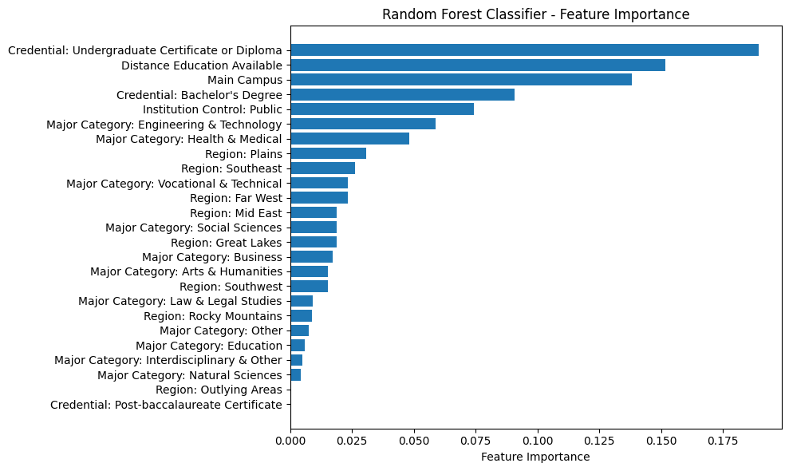

# College Loan Default Risk

*Brian Hunt & Logan Laszewski*

> **Business Question:** Given that student-loan default harms borrowers, exposes institutions to federal-aid sanctions, and signals systemic failures in program-level ROI, can program-level and institution-level College Scorecard data reliably classify high-default-risk educational pathways early enough to support intervention by students, schools, and policymakers before outcomes deteriorate?

---

## What This Project Does

This project uses U.S. Department of Education College Scorecard data to build a binary classification model that flags higher-education programs with elevated federal student-loan default risk. Four models are compared — Logistic Regression, Lasso, Ridge, and Random Forest — with the goal of identifying which credential, program, regional, and institutional characteristics most reliably predict borrower default.

The practical output is an early-warning framework: a decision-support tool that could surface high-risk pathways before students enroll and before default outcomes compound.

---

## Metric Definitions

| Metric | Definition |
|---|---|
| **BBRR3_FED_COMP_DFLT** | % of undergraduate federal borrowers who defaulted within 3 years of program completion (source: College Scorecard) |
| **High Default Risk (target)** | Binary: `1` if 3-year default rate > 10%; `0` if ≤ 10% |
| **Precision** | Of programs flagged high-risk, what share actually are? Minimizes false alarms on institutions |
| **Recall** | Of truly high-risk programs, what share did the model catch? Minimizes missed exposure for students |
| **F1-Score** | Harmonic mean of Precision and Recall; primary model selection criterion given class imbalance |
| **Feature Importance** | Random Forest: mean decrease in impurity per feature across all trees |
| **Permutation Importance** | Model-agnostic: drop in F1 when a feature's values are randomly shuffled |
| **UNITID** | U.S. DOE unique institution identifier; used to join program-level and institution-level datasets |
| **Credential Level** | Degree or certificate type (e.g., Associate, Bachelor's, Undergraduate Certificate/Diploma) |

---

## Data Validation

| Check | Method | Result |
|---|---|---|
| Dataset join integrity | Merged Field-of-Study and Institution-level files on `UNITID`; verified row count before and after merge to confirm no row inflation | Confirmed clean merge — row count matched field-of-study file |
| Target variable parsing | `BBRR3_FED_COMP_DFLT` contains ranges (e.g., `0.05-0.1`), inequalities (e.g., `<=0.02`), and suppressed values (`PS`); midpoints used for ranges, boundary values used for inequalities, then converted to binary via 10% threshold | All non-numeric values handled explicitly; suppressed (`PS`) and null rows excluded before classification |
| Privacy suppression | Suppressed cells (privacy-protected program-level data, flagged as `PS`) removed from modeling set prior to feature engineering and model training | Documented in notebook — 9,724 rows removed; final modeling set contains 9,497 complete records |
| Class balance | Checked distribution of `1` vs `0` labels after target variable construction | Near-balanced: 4,612 high-risk (`1`) vs 4,885 low-risk (`0`); Precision/Recall/F1 used as primary metrics instead of accuracy |
| Feature leakage check | Outcome-correlated fields (e.g., repayment rates, delinquency rates, and deferral rates derived from the same borrower cohort) reviewed before inclusion | `BBRR3_FED_COMP_DLNQ`, `BBRR3_FED_COMP_NOPROG`, `BBRR3_FED_COMP_MAKEPROG`, and `BBRR3_FED_COMP_DFR` excluded from final feature set |

---

## Key Results

| Model | Strength | Use Case |
|---|---|---|
| Logistic Regression | Interpretable coefficients, directional effects | Policy explanation, stakeholder communication |
| Lasso Logistic | Automatic feature selection via L1 penalty | Sparse, auditable models |
| Ridge Logistic | Handles multicollinearity in correlated program features | Stable coefficient estimates |
| Random Forest | Captures nonlinear interactions; highest predictive performance | Operational flagging system |

**Strongest default-risk predictors:**
- Credential level — undergraduate certificates and diplomas carry the highest risk; bachelor's programs the lowest
- Institution type and control (for-profit vs. public vs. private nonprofit)
- Region
- Field of study / major category
- Select program clusters: Engineering & Technology, Health & Medical fields

---

## Visuals

### Default Risk by Credential Type

Undergraduate Certificate and Diploma programs concentrate the majority of high-default-risk labels. Bachelor's Degree programs skew sharply toward low risk. Credential type is the single strongest predictor across all models.


---

### What the Model Learned: Feature Importance (Random Forest)

Gini feature importance confirms credential type as the dominant decision variable across the Random Forest ensemble — consistent with what the Logistic Regression coefficients show. Distance education status and region are secondary signals.



---

### Default Risk by Field of Study

Beyond credential type, field of study adds meaningful signal. Vocational & Technical programs and Engineering & Technology show elevated high-risk shares, while Health & Medical and Natural Sciences programs skew lower.


---

## Commercial Implications

The strongest predictors of default — credential level, institution type, and field of study — are knowable at the point of enrollment, not after it. That means this classification framework has real pre-decision value:

- **For students:** A program-level risk flag at enrollment could change the financing decision, not just document the outcome afterward.
- **For institutions:** Schools near the 10% default threshold can identify which programs are driving risk and restructure them before triggering federal Cohort Default Rate consequences.
- **For lenders and servicers:** Program-level default signals can sharpen underwriting on income share agreements, refinance products, and default-prevention outreach targeting.
- **For policymakers:** Credential-level and institution-type patterns justify differentiated federal aid policy rather than uniform treatment across all program types.

A practical deployment would be an interactive dashboard — filterable by credential type, major, region, and institution type — that surfaces program-level financial risk at the point of application, not after disbursement.

---

## Limitations

- The 10% default threshold is a judgment call. Results are sensitive to this cutoff; a full threshold-sensitivity analysis would strengthen any policy application.
- Privacy suppression removes some of the highest-risk programs (small, specialized credentials) from the modeling set, potentially understating risk at the tail.
- The College Scorecard reflects reported outcomes, not causal program quality. Correlation between credential type and default risk may partly reflect selection into those programs.
- Models were not validated on a held-out temporal sample. Cross-sectional performance may overstate generalization.

---

## Repository Structure

```
CollegeLoanDefaultRisk/
  README.md                                         ← Start here
  College Scorecard Data & Loan Default Risk.ipynb  ← Full analysis notebook
  college_scorecard_default_risk_paper.pdf          ← Written report
  images/                                           ← Chart exports from notebook
```

**Data source:** [U.S. Department of Education College Scorecard](https://collegescorecard.ed.gov/data/) — Field of Study file and Institution-level file, merged on `UNITID`.
